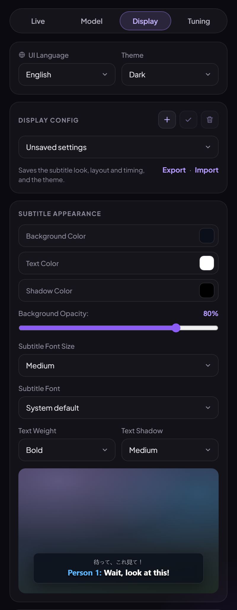

# Subtitle display & themes

{ width="260" }
{ width="260" }

## Subtitle appearance

The **Display** tab sets the subtitles' colours, background opacity (0 % means no box at all), font
size (7 sizes), font (8 system fonts), text weight, and shadow or outline, with a live preview.

## Subtitle layout

- **Position:** bottom, top, or wherever you last dragged the subtitles on the page (double-click them
  to reset).
- **Original text** (in Bilingual Mode): above or below the translation, and how big it is.
- **History lines:** show the latest line only, or one or two earlier lines too.
- **Keep subtitle box on screen:** keeps the box visible between lines.

How long each line stays up is set on the Tuning tab: *Extra Time On Screen* and *Minimum Display Time*.

## Themes

The popup comes in:

- **Dark**, **Light** and **Hybrid** (dark shell with light panels);
- **Sakura Light** and **Sakura Dark** — cherry-blossom pinks on a blush page or a plum night;
- the OLED family with a blue accent: **OLED Light** (white), **OLED Dim** (dark navy) and
  **OLED Black** (true black `#000`, no background glow: on OLED / AMOLED screens black pixels are
  switched off);
- **System**, which follows Windows' light or dark setting;
- **Custom**, your own.

Themes only change colours; the layout is the same in all of them.

### Custom theme

Pick **Custom** and set:

- **Style:** **Glass** (glowing background, see-through panels, like Dark and Light) or **Flat**
  (solid surfaces, like the OLED themes);
- **Start from:** any built-in theme, as a starting point;
- **Colours:** background, panels, accent and buttons;
- **Text:** headings, labels, text, hints and dropdowns.

Text that would be hard to read on your background is lightened or darkened just enough to stay
readable. Save it with a [display config](profiles.md#display-configs) to keep several.
