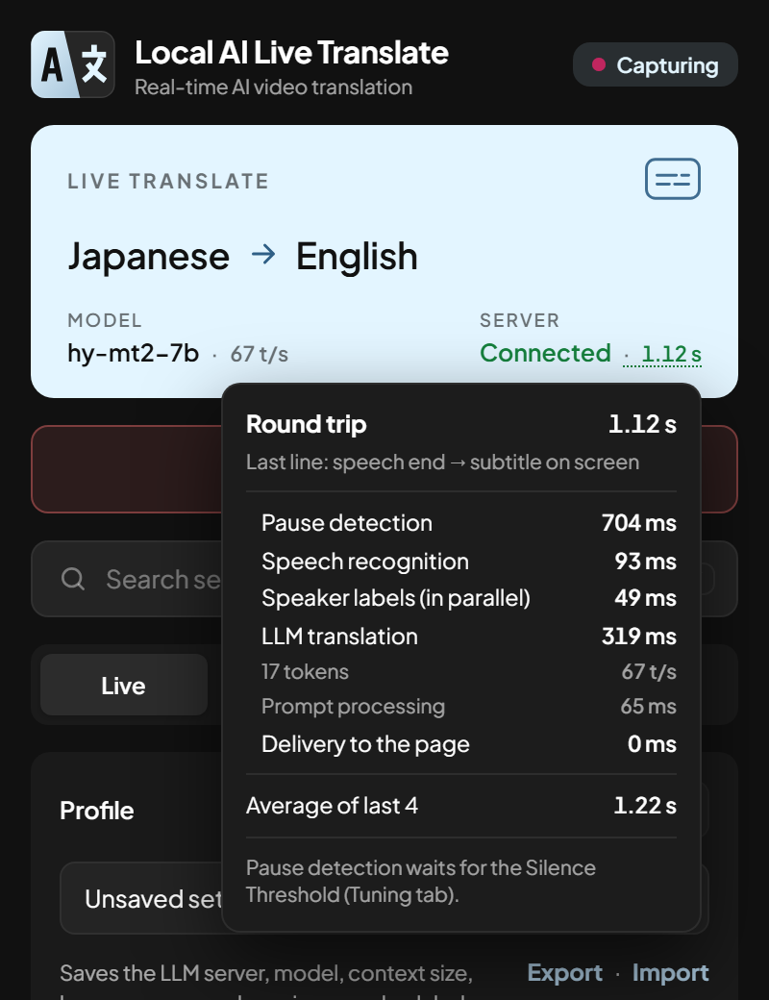

# Live captions

## Languages

The video and subtitle languages can each be Traditional or Simplified Chinese, English, Japanese,
Korean, Spanish, Portuguese, French, Italian, German, Dutch, Russian, Ukrainian, Polish, Turkish,
Indonesian, Vietnamese, Thai, Malay, Filipino, Hindi, Bengali or Arabic, and the video can also be in
**Cantonese**. Arabic subtitles are laid out right to left. The language menus have a search box.

- **Cantonese** is shown in Traditional characters and translated into standard written Chinese for
  Chinese subtitles (呢幾個字都表達唔到 → 這幾個字都表達不了), not just converted character by
  character. It isn't offered as a subtitle language: the recommended model writes formal Chinese
  rather than colloquial Cantonese.
- **Bilingual Mode** shows the original line with the translation. To change where it goes and how
  big it is, see [Subtitle display](display.md).

The popup itself is available in Chinese (Traditional and Simplified), English, Japanese, Korean,
Spanish, French, German, Russian and Indonesian.

## Speed and latency

{ width="300" align="right" }

While captions run, the status card shows:

- next to the model, its **generation speed** on the last translated line (e.g. *64 t/s*, as LM Studio
  and Ollama measure it);
- next to the server, the **round trip** of the last line — from the moment the speaker stopped to the
  subtitle reaching the page — in green (under 1.5 s), amber (under 3 s) or red.

Hover over the round trip for the breakdown: pause detection (mostly the
[Silence Threshold](tuning.md)), speech recognition, speaker labels (they run at the same time as
recognition), waiting behind the previous line, LLM translation (tokens, speed and prompt
processing) and delivery, plus the average of the last 10 lines. The numbers are clock readings taken
along the way and sent with each subtitle, so measuring them doesn't slow anything down.

## Label speakers

**Label speakers** (Live tab) puts *Person 1:*, *Person 2:* … in front of each line, in a different
colour per person, for conversations and group videos. Numbering starts again each time you start
captions.

*Speaker Separation* (Tuning tab, shown while it's on) sets how different two voices must be to count
as two people: raise it if two people get the same number, lower it if one person gets split into two.
It works best on clear speech: music, laughter or two people talking at once can confuse it, and a
very short line (under 1 s) keeps the previous speaker's number.

## Keyboard shortcut

++alt+shift+l++ starts or stops live translation on the current tab without opening the popup (an
**ON** badge shows on the icon while it runs). Change it on the Live tab or at
`chrome://extensions/shortcuts`.

## Search settings

Type in the search box under the start button (or press ++slash++) to find any setting. It's
forgiving about typos and abbreviations ("opacty", "fnt sz", "ctx") and knows a few synonyms
("transparency", "hotkey", "noise"). Pick a suggestion with the mouse, or the arrow keys and
++enter++, to jump straight to that setting.

## Right-click to paste

Right-click in any text field (a server address, an API key, a name or a search box) to paste into
it, as in a terminal. With text selected, right-click copies it instead. **Shift** + right-click opens
the browser's usual menu.

## Save transcripts

**Save transcripts** (Live tab) is off by default. When on, each session is saved as a Markdown file
in the app's `transcripts/` folder, with the original and translated text of every line.
