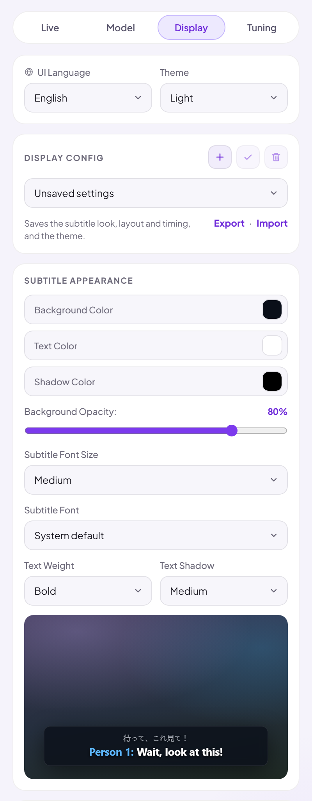
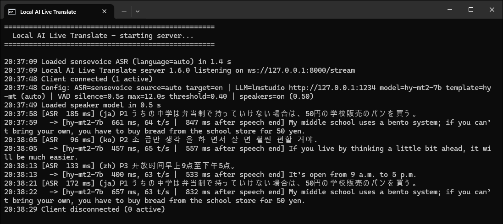

# Local AI Live Translate

Real-time translated subtitles for any video or stream playing in Chrome. Speech recognition and
translation both run on your own PC, with a local model served by LM Studio (or Ollama). Online AI
providers — Qwen, OpenAI, Anthropic, DeepSeek, Google Gemini and xAI Grok — can be turned on as an option.

[Install :material-download:](getting-started/install.md){ .md-button .md-button--primary }
[Which model? :material-chart-scatter-plot:](models/index.md){ .md-button }
[GitHub :material-github:](https://github.com/xinjalin/Local-AI-Live-Translate){ .md-button }

<div class="shots" markdown>
{ width="260" }
{ width="260" }
</div>

## What it does

- **24 languages**, including Cantonese as a video language, with the original line alongside the
  translation if you like.
- **Fast:** a finished subtitle typically appears about a second after the speaker stops.
- **Private:** everything runs on your PC, and nothing is sent online unless you turn on an online provider.
- **Speaker labels** (*Person 1*, *Person 2* …), saved **profiles** and **display configs**,
  **themes** including your own, and a popup in **10 languages**.

## How it works

```
Chrome extension ──audio──> Local AI Live Translate server ──> LM Studio (local LLM)
                  <─subtitles─     (speech recognition)            (translation)
```

- Tab audio is streamed to the app server on your PC (`ws://127.0.0.1:8000/stream`).
- Silero VAD cuts the audio into sentences (with 0.2 s of pre-roll so the first syllable isn't
  clipped), and SenseVoice, Dolphin, Omnilingual or Whisper-Small transcribes them on the CPU
  ([Speech engines](models/speech-engines.md)).
- Lines already in the subtitle language skip the LLM, and Chinese is converted between Traditional
  and Simplified instantly with OpenCC (with Taiwan phrasing for Traditional Chinese). Everything else
  is translated by the local LLM, with the previous 4 lines as context so that names, pronouns and
  misheard words come out right.
- Recognition and translation run in parallel, and the LLM is called over one kept-alive
  connection, so a finished subtitle typically appears 0.7–1.0 s after the speaker stops.
- With **Label speakers** on, each line also gets a voice fingerprint (3D-Speaker CAM++), computed
  on its own thread at the same time as the speech recognition, so lines don't arrive any later.
  The fingerprint is compared with the voices heard so far: a close match gets that person's
  number, and a new voice becomes the next *Person n*.

The server window logs each line as it's recognised (with the language and speaker) and translated
(with the model's time and speed):



*Screenshots from a real run on an RX 9070 XT, using the SenseVoice test clips.*
